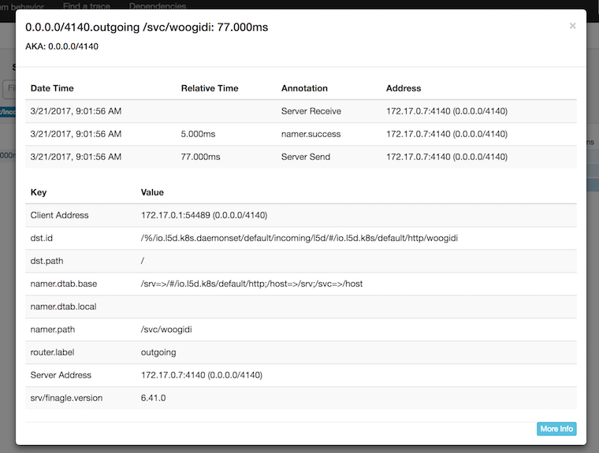

## Why Are Microservices Hard?

Conceptually when moving to microservices it will solve a lot of major problems we face with monolithic applications. The overhead that I mentioned in the later portion of [Introduction on Migrating to Microservices](http://jt.codes/Migration-to-Microservices) can be hard to wrap our heads around. We need to establish tracing, monitoring, load balancing, service discovery, dynamic request routing, TLS, circuit breaking and more. **What are these things and what do they even mean?!**

### Complexities... Say What??

What is distributed tracing, service discovery, circuit breaking...? -- The list goes on. One of these, distributed tracing, is one of the most underrated tools to help with monitoring our services. Distributed tracing is key to what is going on within a single call into our microservice architecture. We can follow the lifespan of a request, see what's going on and where things are getting bottled up. 

_Distributed tracing provides a holistic view of requests transiting through multiple services, allowing for immediate identification of latency issues._

### One Tool To Rule Them All

> "Enter Linkerd"

[Linkerd](https://linkerd.io/) is an open source project that is built off of Twitter's [finagle](https://twitter.github.io/finagle/). It doesn't lock developers into a single JVM, .NET, JS, etc. language. It's core principle is catering to developers as they migrated to these complex system architectures.

Linkerd solves many of the fundamental problems we face with microservices. While distributed tracing is at the center of this article. I will, in the near future, go more in depth about other complexities Linkerd solves.

### Hands On

The Buoyant [blog](https://blog.buoyant.io/) is a fantastic way to get started with Linkerd. They truly simpilfy how things are working under the covers and give real examples of how to incorporate Linkerd into your architecture.

Since [Kubernetes](https://k8s.io/) is the ["Linux of the Cloud"](https://www.youtube.com/watch?v=3MyYhSnHGm0) I am going to walkthrough a quick example of using [Zipkin](http://zipkin.io/) and Linkerd -- running on Kubernetes as a DaemonSet. Zipkin simply is a distributed tracing tool. The source code for this walkthrough is [here](https://github.com/jtaylor32/woogidi-woogidi-woogidi).

### Kubernetes: Creating the Services and Pods

You can set your `namespaces` separately, but this is a simple tutorial on how to stand up an app insides Kubernetes and have traffic routed and traced using Linkerd + Zipkin. Note: Commands will be based on a [minikube](https://github.com/kubernetes/minikube) cluster -- can be ported to actual Kubernetes seamlessly.

#### Install/Configure Linkerd

This command will apply a ConfigMap for Linkerd as a DaemonSet to route traffic in and out of specific ports. 

~~~
kubectl apply -f https://raw.githubusercontent.com/jtaylor32/woogidi-woogidi-woogidi/master/k8s-configs/linkerd-zipkin.yml
~~~
{: .language-bash}

Once the service is running you can open the admin dashboard. This will be where you can monitor inbound/outbound traffic; as well as configure your routing within the "dtab" and other cool features.

~~~
minikube service l5d
~~~
{: .language-bash}

*Linkerd Dashboard*

Run the service. This should create a replication set of 3 pods named "woogidi" (reminiscing on [Rocket Power](https://en.wikipedia.org/wiki/Rocket_Power) days). This service will be listening on _port 8080_.

~~~
kubectl apply -f https://raw.githubusercontent.com/jtaylor32/woogidi-woogidi-woogidi/master/k8s-configs/woogidi-woogidi-woogidi.yml
~~~
{: .language-bash}

To check if the service is working correctly we can do a simple curl commands. 

~~~
# Set the L5D_INGRESS_LB so we can http_proxy to the service 
L5D_INGRESS_LB=$(minikube service l5d --url | head -n1)

http_proxy=$L5D_INGRESS_LB curl -XPOST -d '{"gnarly": "Otto"}' http://woogidi/

{"response":"let's crank Otto"}
~~~
{: .language-bash}

Sick. Us and Otto are going to go shred some gnar! This is all because the Linkerd service that is running is configured to route traffic to this service. It acts as a service discovery tool as well!

But what if something is getting bottlenecked somewhere in the request chain or is failing and we can't detect that? Here is where we need to configure Zipkin inside our cluster.

~~~
kubectl apply -f https://raw.githubusercontent.com/jtaylor32/woogidi-woogidi-woogidi/master/k8s-configs/zipkin.yml
~~~
{: .language-bash}

Open the Zipkin dashboard once the service starts.

~~~
minikube service zipkin
~~~
{: .language-bash}

The dashboard allows us to do some filtering on requests that are going through the Linkerd service. We can also dive into specific requests and calls within Zipkin.

#### Snapshots of Zipkin Interface

*Zipkin Dashboard*

*Single Request*

*Single Trace Call*

### What's Next?

Now we can monitor, tracing and do some simple service discovery within Kubernetes we need to expand and have log monitoring, ingress (load balancing), and other features solved. 

- Log monitoring will include -- [Prometheus](https://github.com/prometheus) + [Grafana](https://github.com/grafana/grafana).

- Ingress will include a way to traffic our requests to Linkerd using [nginx](https://github.com/nginx/nginx) as our proxy.

> Feel free to reach out to me and ask questions or bring up other topics you'd like me to write about! 

