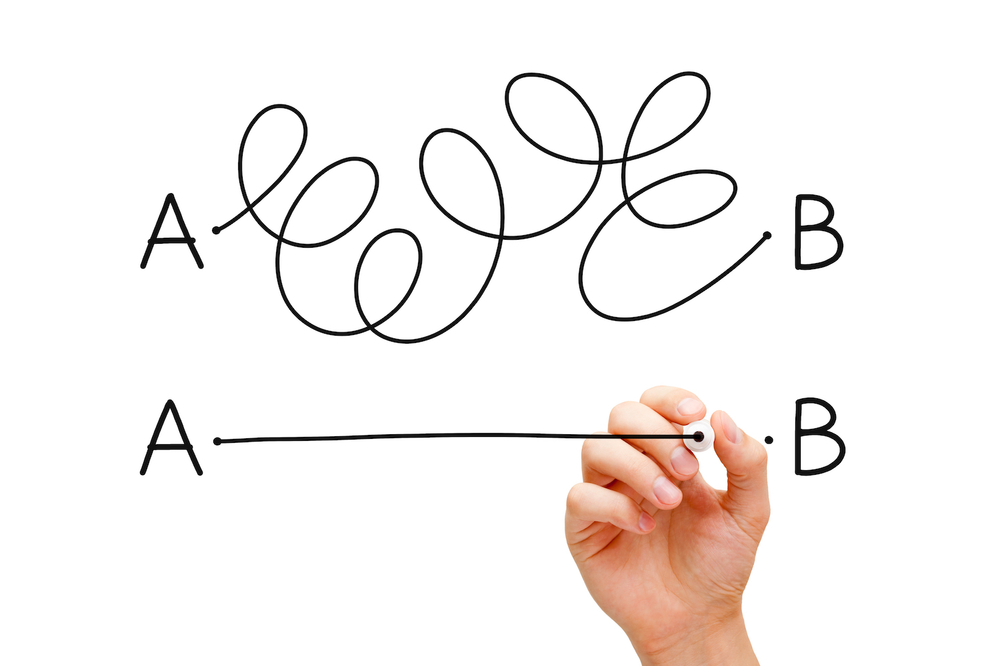

## Interfaces Basics

Go's known for it's concurrency model but I believe the biggest attraction to this language is it's interfaces and the beautiful abstractions they can give us.

Interfaces are, at their core, ways to describe behaviors and group functions within APIs. You can think of them as generalizations about the behavior of concrete types within your Go programs. The biggest difference maker in the way Go describes interfaces is that you can create new interfaces that are satisfied by already existing types without changes the existing types. They are *"satisfied implicitly"*.

Interfaces are labeled as *abstract types*. The only things that we can conclude from interfaces are what they *can do* -- we don't know anything else about them other than their *behaviors* like we said earlier.

---

## Interface Types

An interface type declares a set of methods that a concrete type (struct or other type) must satisfy to implement that interface. This gives us the contractual rules that we can set for our interface behaviors.

The best, and most widely used interface in the Go standard library is the `io.Writer` type. Here are some excerpts from the **io** package.

~~~
package io

type Reader interface {
    Read(p []byte) (n int, err error)
}

type Writer interface {
    Write(p []byte) (n int, err error)
}

type Closer interface {
    Close() error
}
~~~
{: .language-go}

You can see we have three basic interfaces that define some behaviors we might want to satisfy when we are trying to manipulate bytes within our programs. They are well named and you can infer what sorts of things concrete types will do if they satisfy these interfaces.

A concrete type that implements the Reader interface better have a method of `Read` and it must take in an array of bytes and return an int with an error.

### Embedding Interfaces

Interfaces also give us the ability to embed other interfaces within each other similar to how we can do embedding within structs.

The **io** package is a great example of this as well.

~~~
package io

type ReadWriter interface {
    Reader
    Writer
}

type ReadCloser interface {
    Reader
    Closer
}

type ReadWriteCloser interface {
    Reader
    Writer
    Closer
}
~~~
{: .language-go}

Here we can do some more inferences that concrete types can satisfy -- they are either going to be either reading and writing, reading and closing and so on. They **must** satisfy those underlying interfaces though. If something is an instance of the `ReadWriter` interface you better believe it satisfies the `Reader` **and** `Writer` interfaces.

With these concrete types implementing these interfaces their methods are polymorphic in nature. This can create much more cleaning interfaces without having to redefine behaviors. This also still keep our behaviors as granular as possible. We are building much more readable and usable APIs!

Another implication we see is that anything that satisfies the `ReadWriteCloser` interface also satisfies the `ReadWriter` and the `ReadCloser`. Because types that implement `ReadWriteCloser` satisfy all three interfaces they also satisfy the other two composite interfaces. In turn the other two do not satisfy the third `ReadWriteCloser` interface -- every method must be satisfied to be defined as an instance of that interface (remember that!).

## Re-Grouping Our Behaviors

When designing and implementing our Go programs we have to think about minimal ways to describe things though. Interface pollution IS a thing -- this is when we don't need them and can just use concrete types instead. There are trade offs to using interfaces and I will go more into depth later on in this Deep Dive series.

In the full circle of it everyone has written bad code in their lifetime -- it's not about that though. We have to understand that we are writing code that is easy to use and simple to understand. This goes for our interfaces as well.

We are going to have some interfaces describing some streaming service we are developing. We are going to have all kinds of media types and we decided on implementing some interfaces to describe their behaviors.

~~~
type Text interface {
    Pages() int
    Words() int
}

type Audio interface {
    Stream() (io.ReadCloser, error)
    DurationTime() time.Duration
    FormatType() string
}

type Video interface {
    Stream() (io.ReadCloser, error)
    DurationTime() time.Duration
    FormatType() string
    Resolution() (x, y int)
}
~~~
{: .language-go}

If you notice there are some things that we might be able to group with common behaviors within those few basic interfaces. The great thing about changing these behaviors to use this new `Streamer` type is that it will not break the underlying concrete types that are implementing these methods on top of the Video and Audio interface types.

~~~
type Streamer interface {
    Stream() (io.ReadCloser, error)
    DurationTime() time.Duration
    FormatType() string
}

~~~
{: .language-go}

---

Like we said earlier there are trade-offs to learning and implementing interfaces. I would suggest to absolutely try and incorporate them into your programs but understand that there are times and places for them. Think simple and minimal with designs. Interfaces can create solid abstractions for our concrete types throughout our programs without breaking things underneath.

Later in this series I will breakdown the trade-offs of why interfaces could be beneficial to us or not. There are some factors to take into account that we need to understand about interfaces. What allocations are happening and what sort of things can hinder our programs down the line with too many or exported vs. non-exported interfaces.
